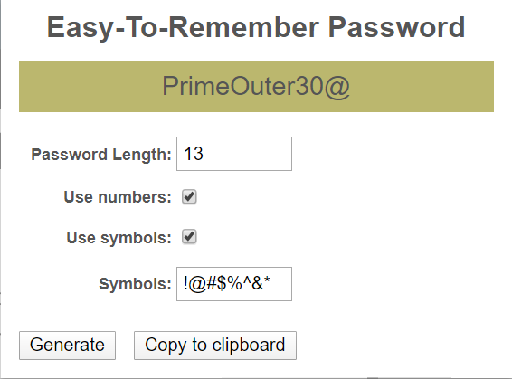

# A easy-to-remember password generator chrome add-in

This chrome add-in can be used to generate human readable passwords. Like a lot of people I was using a few common passwords on a lot of sites which is a really bad security practice. I needed passwords which I could remember.

All popular password managers like LastPass, 1Password, Dashlane have password generators but generate unreadable passwords

 1. [LastPass generator](https://www.lastpass.com/password-generator)
	 - Example: 
		 - #P@8Mh8PU9*t
		 - *oP6RWYmaVif  	
 2. [1Password generator](https://1password.com/password-generator/)
	 - Example:
		 - P52QvT5rpWo
		 - adroit-solvency-heaven 
		 - lithium-almost-whom
 3. [Dashlane generator](https://www.dashlane.com/features/password-generator)
	 - Example:
		 - ~6R"N#M'FFt 
		 - *xf8mbrXp$.
		 - *yMn'!d"h8E

1Password comes closest with its "Memorable Password" but the password is too long. Sure the passwords are secure but I think we can do better. 

# Installation
Link to chrome store. Try it now!
<a href="https://chrome.google.com/webstore/detail/easy-to-remember-password/ghjkkmcnhfbkboghadcdemdkapnfiddp?hl=en" target="_blank">Easy-Remember-Password chrome add-on</a>

<!--stackedit_data:
eyJoaXN0b3J5IjpbLTE0MDYxMDg4OTgsMTIxOTMyMDE5OCwtMT
gyMDM5OSwxMDg1NTgwODI3LDIwNzExOTUxMDYsODkzMzI4MTE1
LDE4NTA2OTQwOTgsLTM4MTc4Mjk5MCwxOTE5ODU5NzUzLC0yMD
kzNjQ0NDU4XX0=
-->